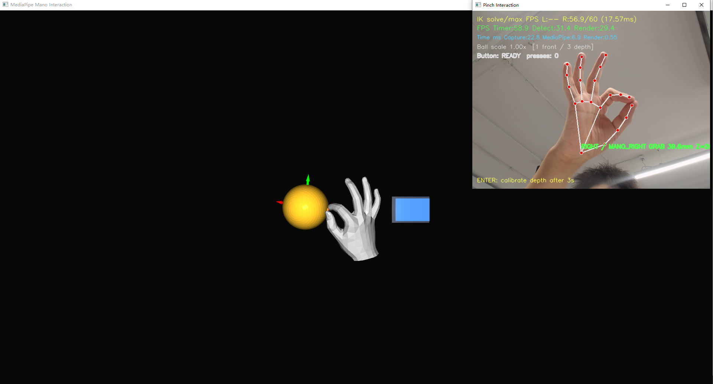

# MediaPipe2Mano

项目使用 RGB 摄像头通过 MediaPipe Hands 获取手部关键点，通过 MANO + IK 生成手部网格和骨架，另包含深度估计与交互预览。

## 运行预览



由于摄像头面向人物进行拍摄，因此进行镜像处理。主观视角中，恢复的手部与现实朝向一致。

## 目录结构

```text
MediaPipe2Mano/
├─ MediaPipe2ManoRuntime/    检测、跟踪、MANO IK 与公共 C++ API
├─ MediaPipe2ManoViewer/     Qt/OpenCV/Open3D 示例程序
├─ assets/                   MediaPipe 模型
├─ models/                   MANO 左右手模型
├─ configs/                  运行配置
├─ ThirdParty/               Qt、OpenCV、Open3D 与 MediaPipe 依赖
└─ docs/                     开发说明与公共 API
```

包含两个项目：

| 项目 | 输出 | 职责 |
| --- | --- | --- |
| `MediaPipe2ManoRuntime` | `MediaPipe2ManoRuntime.dll/.lib` | 图像检测、左右手稳定、滤波、深度估计、MANO IK、骨架和交互状态 |
| `MediaPipe2ManoViewer` | `MediaPipe2ManoViewer.exe` | 摄像头/视频输入、二维标注、Open3D 预览和性能统计 |

## 构建

### 1. 下载项目

```powershell
git clone https://github.com/Ayluuur/MediaPipe2Mano.git
cd .\MediaPipe2Mano
```

### 环境要求

- Windows 10/11 x64
- Visual Studio 2022
- MSVC v143

### 2. 打开解决方案

```powershell
start .\MediaPipe2Mano.sln
```

在 Visual Studio 中将 `MediaPipe2ManoViewer` 设为启动项目。

### 3. 选择构建配置

| 配置 | 用途 |
| --- | --- |
| `Develop` | 开发调试和功能验证 |
| `Release` | 性能测试和交付 |


### 4. 生成解决方案

Visual Studio 中的“生成 → 生成解决方案”执行构建。

构建结果位于 `bin/<配置>/`。


## 运行

直接启动程序会显示 Qt 模式选择窗口：

```powershell
.\bin\Develop\MediaPipe2ManoViewer.exe
```

| 模式 | 功能 |
| --- | --- |
| 网格预览 | 原版的双手预览 |
| 手部交互 | 镜像后的双手恢复与交互实现 |
| 并行 IK | 手部交互基础上的多线程模式 |

三种模式分别读取：

- `configs/viewer.json`
- `configs/interaction.json`
- `configs/parallel_ik.json`


## 配置

| 分组 | 用途 |
| --- | --- |
| `camera` | 摄像头编号、分辨率和画面镜像 |
| `detector` | MediaPipe 模型、手数、置信度和 XNNPACK 线程数 |
| `performance` | 检测与渲染帧率 |
| `mano` | IK 迭代、姿态平滑、提交帧率和 Jacobian worker |
| `tracking` | handedness 稳定与位置滤波 |
| `depth_estimation` | 深度范围、标定和滤波 |
| `pinch`、`ball`、`button` | 交互阈值和场景尺寸 |


## 开发文档

- [开发说明](docs/README.md)
- [公共 C++ API](docs/API.md)
